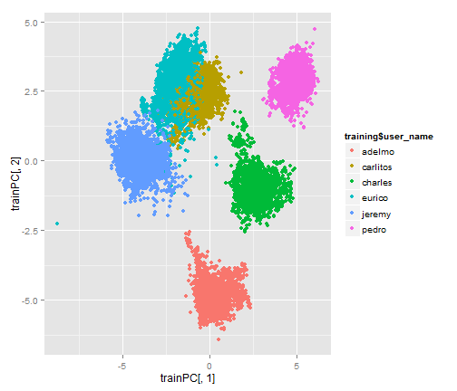

Predicting activity quality
========================================================

## Summary

There was a high correlation between measurements from the sensors, so principal component analysis was used to remove redundant variables.

The first two principal components provide a good separation of the measurements by the participant, so dummy variables based on a participant's name were not used.

Using a random forest model trained on twelve principal components gave an out of bag error estimate of 2.7%. The random forest was trained on 80% of the data leaving 20% of the data as a test set. The classification accuracy on the test set was 97.2%, giving an error rate of 2.8% which is consistent with the out of bag error rate.

## Preprocessing

Blanks and the string 'NA' were treated as NA values. Columns which contained more than 50% NA values were excluded, because imputation didn't seem practical.


```r
library(caret)
```

```
## Warning: package 'caret' was built under R version 3.1.1
```

```
## Loading required package: lattice
## Loading required package: ggplot2
```

```r
library(randomForest)
```

```
## Warning: package 'randomForest' was built under R version 3.1.1
```

```
## randomForest 4.6-10
## Type rfNews() to see new features/changes/bug fixes.
```

```r
exerciseData <- read.csv("pml-training.csv", header = TRUE, na.strings = "")
set.seed(9283)

cleanNAs <- function(df) {
    
    df[df == "NA"] <- NA
    if (sum(df == "NA", na.rm = TRUE)) 
        print("Error cleaning NA values")
    trDims <- dim.data.frame(df)
    naCounts <- colSums(is.na(df))
    tooManyNA <- naCounts > 0.5 * trDims[1]
    df <- df[, !tooManyNA]
    
}

exerciseData <- cleanNAs(exerciseData)
```


The data were partitioned into a training set with 80% of data and a testing set with 20% of data.


```r
inTrain <- createDataPartition(exerciseData$classe, p = 0.8)[[1]]
training <- exerciseData[inTrain, ]
testing <- exerciseData[-inTrain, ]
```


The most relevant data for prediction seemed to be the numerical data captured by the sensors, because they were the direct result of the motion being classified. 


```r
isNumeric <- function(colName) {
    cl <- class(exerciseData[colName][, 1])
    cl == "numeric" || cl == "integer"
}
numCols <- sapply(names(exerciseData), isNumeric)
```


The data were scaled and centered to make them more comparable and suited for a learning algorithm.


```r
scaleCent <- preProcess(training[, numCols], method = c("center", "scale"))
trainNumCols <- predict(scaleCent, training[, numCols])
testNumCols <- predict(scaleCent, testing[, numCols])
```


Numerical data gathered from the same sensor were highly correlated.


```r
M <- abs(cor(trainNumCols))
diag(M) <- 0
which(M > 0.8, arr.ind = T)
```

```
##                  row col
## yaw_belt           7   5
## total_accel_belt   8   5
## accel_belt_y      13   5
## accel_belt_z      14   5
## accel_belt_x      12   6
## magnet_belt_x     15   6
## roll_belt          5   7
## roll_belt          5   8
## accel_belt_y      13   8
## accel_belt_z      14   8
## pitch_belt         6  12
## magnet_belt_x     15  12
## roll_belt          5  13
## total_accel_belt   8  13
## accel_belt_z      14  13
## roll_belt          5  14
## total_accel_belt   8  14
## accel_belt_y      13  14
## pitch_belt         6  15
## accel_belt_x      12  15
## gyros_arm_y       23  22
## gyros_arm_x       22  23
## magnet_arm_x      28  25
## accel_arm_x       25  28
## magnet_arm_z      30  29
## magnet_arm_y      29  30
## accel_dumbbell_x  38  32
## accel_dumbbell_z  40  33
## gyros_dumbbell_z  37  35
## gyros_forearm_z   50  35
## gyros_dumbbell_x  35  37
## gyros_forearm_z   50  37
## pitch_dumbbell    32  38
## yaw_dumbbell      33  40
## gyros_forearm_z   50  49
## gyros_dumbbell_x  35  50
## gyros_dumbbell_z  37  50
## gyros_forearm_y   49  50
```


Principal component analysis was used to reduce the number of numerical variables from 56 to 12. This number of principal components was decided on after training multiple random forest models, increasing the number of principal components until the decrease in out of bag error became negligible.


```r
prinCom <- preProcess(trainNumCols, method = "pca", pcaComp = 12)
trainPC <- simplify2array(predict(prinCom, trainNumCols))
testPC <- simplify2array(predict(prinCom, testNumCols))
```


```r
finalTestPC <- simplify2array(predict(prinCom, finalTestNumCols))
```


The first two principal components gave a very good separation of the data by user_name. Because of this, dummy variables based on user_name were not included in the model.


```r
qplot(trainPC[, 1], trainPC[, 2], colour = training$user_name)
```

 


## Results

A random forest model was trained using the randomForest package, which was much faster to train than the rf method in the caret package. The model was trained to predict the classe variable from the first 12 principal components.


```r
trd <- as.data.frame(trainPC)
trd$classe <- training$classe

classeModel <- randomForest(classe ~ PC1 + PC2 + PC3 + PC4 + PC5 + PC6 + PC7 + 
    PC8 + PC9 + PC10 + PC11 + PC12, data = trd)
```


The out of bag error calculated by the random forest algorithm was 2.7%.


```r
print(classeModel)
```

```
## 
## Call:
##  randomForest(formula = classe ~ PC1 + PC2 + PC3 + PC4 + PC5 +      PC6 + PC7 + PC8 + PC9 + PC10 + PC11 + PC12, data = trd) 
##                Type of random forest: classification
##                      Number of trees: 500
## No. of variables tried at each split: 3
## 
##         OOB estimate of  error rate: 2.66%
## Confusion matrix:
##      A    B    C    D    E class.error
## A 4398   28   26    8    4     0.01478
## B   48 2917   56   11    6     0.03983
## C    8   39 2666   20    5     0.02630
## D    5   14   87 2457   10     0.04508
## E    0   10   12   20 2844     0.01455
```


This agreed with the error rate of 2.8% calculated on the test data.


```r
td <- data.frame(testPC)

testPredictions <- predict(classeModel, newdata = td)
accuracy <- sum(testPredictions == testing$classe)/length(testing$classe)
accuracy
```

```
## [1] 0.9722
```

```r
1 - accuracy
```

```
## [1] 0.02778
```


## Conclusion

Based on the out of bag error rate reported by the model and the error rate calculated on the test set, the anticipated out of sample error rate for this model is between 2.7% and 2.8%.
